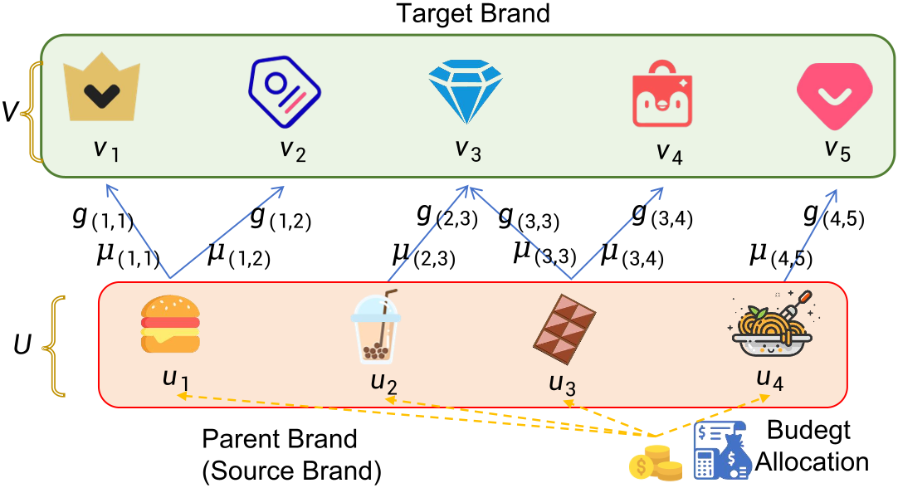
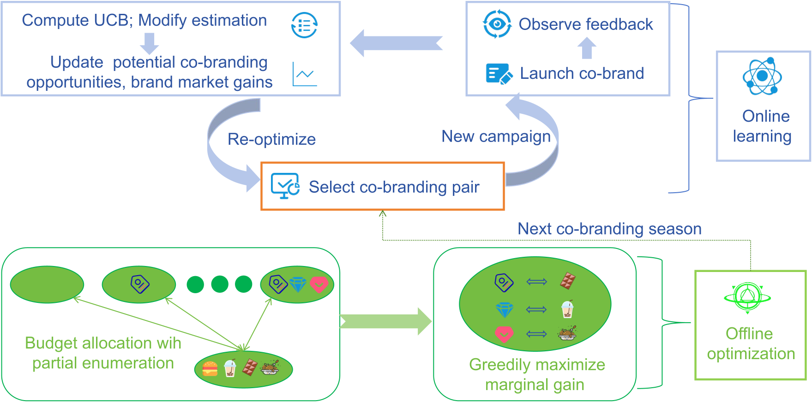

# A Unified Online-Offline Framework for Co-Branding Campaign Recommendations
[](https://zenodo.org/doi/10.5281/zenodo.15532549)
This repository hosts the source code and datasets for the paper "A Unified Online-Offline Framework for Co-Branding Campaign Recommendations". 

<p align="center">
  
</p>

<p align="center">
  
</p>


# Project Structure
```
Co-Branding
├── online
│   ├── CBOL.py                # Co-Branding Online Learning algorithm
│   ├── CUCB.py                # Combinatorial Upper Confidence Bound algorithm
│   ├── EMP.py                 # Empirical Mean algorithm 
│   ├── TS.py                  # Thompson Sampling algorithm
│   └── ε-greedy.py            # Epsilon-greedy exploration strategy
│
├── offline
│   ├── GBO.py                 # Greedy Budget Optimization algorithm
│   ├── GPE.py                 # Greedy Partial Enumeration algorithm
│   ├── PROP_S.py              # Proportional allocation based on sub-brands
│   └── PROP_W.py              # Proportional allocation based on market gains
│
├── data
│   ├── brand_data
│   │   ├── diet
│   │   │   ├── diet_dataset.csv            # Diet brand co-branding dataset
│   │   │   ├── diet_historical_dataset.csv # Historical data
│   │   │   ├── diet_market gain.csv        # Market gains
│   │   │   └── Diet dataset_map.png        # Visualization of diet brand dataset
│   │   │
│   │   ├── apparel
│   │   │   ├── apparel_dataset.csv            # Apparel brand co-branding dataset
│   │   │   ├── apparel_historical_dataset.csv # Historical data
│   │   │   ├── apparel_market gain.csv        # Market gains
│   │   │   └── Apparel dataset_map.png        # Visualization of apparel brand dataset
│   │   │
│   │   └── IP-themed
│   │       ├── IP_dataset.csv                 # IP-themed brand co-branding dataset
│   │       ├── IP_historical_dataset.csv      # Historical data
│   │       ├── IP_market gain.csv             # Market gains
│   │       └── IP-themed dataset_map.png      # Visualization of IP-themed brand dataset
│   │
│   ├── historical_data
│   │   └── historical_data.py                 # Script for generating historical data
│   │
│   ├── source data
│   │   ├── co-brand_ch.xlsx                   # Chinese co-branding source data
│   │   └── co-brand_en.xlsx                   # English co-branding source data
│   └── synthetic_data
│       └── synthetic_data.py                  # Script for generating synthetic data
│
└── asset
    ├── algorithm.png          # Algorithm visualization
    ├── flow.png               # Process flow diagram
    └── model.png              # Model architecture diagram


```

# Requirements

- Python == 3.8.0
- numpy == 1.20.0
- pandas == 1.3.0
- matplotlib == 3.4.0
- scipy == 1.7.0

You can install the required packages using pip:

```bash
pip install -r requirements.txt
```

# Usage

## Running Algorithms

```bash
# Run CBOL algorithm
python online/CBOL.py

# Run CUCB algorithm
python online/CUCB.py

# Run EMP algorithm
python online/EMP.py

# Run Thompson Sampling algorithm
python online/TS.py

# Run Epsilon-greedy algorithm
python online/ε-greedy.py
```


## Experiment results

Please refer to the paper for the experiment results.

## License

This work is licensed under the terms of the [MIT](LICENSE).
